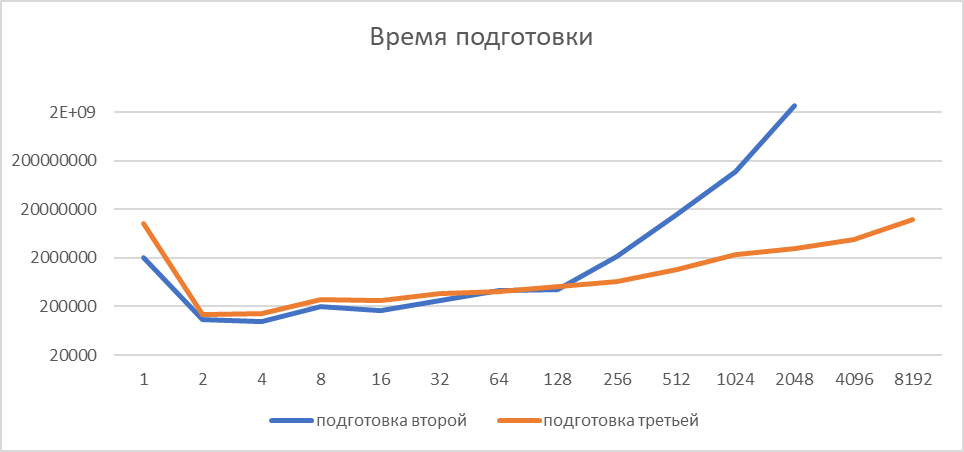
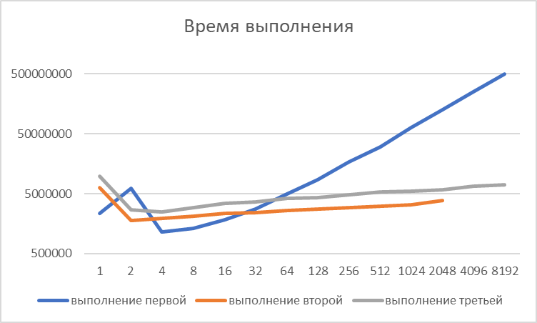
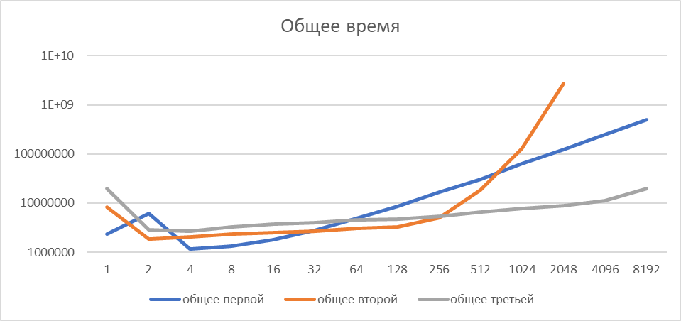

# Лабораторная работа
Я написал 3 алгоритма, которые ищут, сколько данной точки принадлежит прямоугольников на плоскости:
- полный перебор
- сжатие координат и построение карты
- сжатие координат и использование персистентного дерева отрезков
#

## Полный перебор
Без подготовки. При поиске – просто перебор всех прямоугольников.
Подготовка O(1), поиск O(N)
  ```java
  public static void first(Main.Rectangle[] arr, int[][] points, int n, int m) {
      for (int i = 0; i < m; ++i) {
          int x = points[i][0], y = points[i][1];
          int ans = 0;
          for (int j = 0; j < n; ++j) {
              if (arr[j].x1 <= x && x < arr[j].x2 && arr[j].y1 <= y && y < arr[j].y2) {
                  ++ans;
              }
          }
      }
  }
  ```

## Сжатие координат и построение карты
Сжатие координат и построение карты.
Подготовка O(N^3), поиск O(logN)
  ### Подготовка:
```java
  public static void second(Main.Rectangle[] arr, int[][] points, int n, int m) {
      Object[] temp = compress(arr);
      int[] xCCArray = (int[]) temp[0];
      int[] yCCArray = (int[]) temp[1];

      int[][] matrixMap = new int[xCCArray.length][yCCArray.length];

      for (Main.Rectangle rec : arr) {
          int x1 = binarySearch(xCCArray, rec.x1);
          int y1 = binarySearch(yCCArray, rec.y1);
          int x2 = binarySearch(xCCArray, rec.x2);
          int y2 = binarySearch(yCCArray, rec.y2);
          for (int i = x1; i < x2; ++i) {
              for (int j = y1; j < y2; ++j) {
                  ++matrixMap[i][j];
              }
          }
      }...
```
Для каждой точки каждого прямоугольника мы прибавляем единицу на карту, предварительно получая сжатые координаты.
  ### Поиск:
```java
...
      for (int i = 0; i < m; ++i) {
          int x = points[i][0], y = points[i][1];
          int ans = 0;
          int compressedX = binarySearch(xCCArray, x);
          int compressedY = binarySearch(yCCArray, y);
          if (compressedX >= 0 && compressedY >= 0)
              ans = matrixMap[compressedX][compressedY];
      }
  }
```
После сжатия координат мы получаем ответ за O(1).

## Сжатие координат. Персистентное дерево
Сжатие координат и построение персистентного дерева отрезков.
Подготовка O(NlogN), поиск O(logN)
  ### Подготовка:
```java
  public static void third(Main.Rectangle[] arr, int[][] points, int n, int m) {
      Object[] temp = compress(arr);
      int[] xCCArray = (int[]) temp[0];
      int[] yCCArray = (int[]) temp[1];

      List<Main.Event> events = new ArrayList<>();
      for (Main.Rectangle rec : arr) {
          events.add(new Main.Event(Main.Status.Start, binarySearch(yCCArray, rec.y2), binarySearch(yCCArray, rec.y1), binarySearch(xCCArray, rec.x1)));
          events.add(new Main.Event(Main.Status.End, binarySearch(yCCArray, rec.y2), binarySearch(yCCArray, rec.y1), binarySearch(xCCArray, rec.x2)));
      }
      events.sort(Comparator.comparing(Main.Event::getX));

      Main.PersistentTree tree = new Main.PersistentTree(events, yCCArray.length);
...      
```
После сжатия координат, мы создаем отсортированный список событий, которые состоят из координаты Х, и двух координат Y, а так же статус, являются ли они началом прямоугольника или концом.
Затем мы строим персистентное дерево отрезков, где каждый новый корень - это каждая новая координата Х. Мы считаем количество прямоугольников на сжатых координатах Y. Если это является правой границей прямоугольника, то мы вычитаем в узлах 1.
```java
      Node insert(Node root, int begin, int end, Status value) {
          if (begin <= root.lowBorder && root.highBorder <= end)
              return new Node(root.left, root.right, root.lowBorder, root.highBorder, value == Status.Start ? root.value + 1 : root.value - 1);
          if (root.highBorder <= begin || root.lowBorder >= end)
              return root;
          Node newNode = new Node(root.left, root.right, root.lowBorder, root.highBorder, root.value);
          newNode.left = insert(newNode.left, begin, end, value);
          newNode.right = insert(newNode.right, begin, end, value);
          return newNode;
      }
      void buildPersistentTree(int compressedYSize, List<Event> events) {
          Node root = buildTree(0, compressedYSize);
          int currentX = events.get(0).x;
          for (Event event : events) {
              if (currentX != event.x) {
                  roots.add(root);
                  currentX = event.x;
              }
              root = insert(root, event.lowY, event.highY, event.status);
          }
      }
```
  ### Поиск
```java
    private static int getAns(Node node, int compressedY) {
        if (node == null) return 0;
        int mid = (node.lowBorder + node.highBorder) / 2;
        if (compressedY < mid)
            return node.value + getAns(node.left, compressedY);
        else return node.value + getAns(node.right, compressedY);
    }
```
При поиске мы сжимаем координаты, а затем обходим дерево, считая ответ.

## Тестирование
```java
    public static Rectangle[] generateRectangles(int n) {
        Rectangle[] rectangles = new Rectangle[n];
        for (int i = 0; i < n; ++i)
            rectangles[i] = new Rectangle(10 * i, 10 * i, 10 * (2 * n - i), 10 * (2 * n - i));
        return rectangles;
    }
```
Генерация прямоугольников, вложенных друг-в-друга.
```java
    public static int[][] generatePoints(int m, int n) {
        int[][] points = new int[m][2];
        for (int i = 0; i < m; ++i) {
            points[i][0] = (int) (Math.pow(2689 * i, 31) % (20 * n));
            points[i][1] = (int) (Math.pow(3371 * i, 31) % (20 * n));
        }
        return points;
    }
```
Генерация точек, используя хэш функции с большими простыми числами.

## Выводы
Выводы производились при количестве генерации точек = 100_000. Генерация прямоугольников - от 2^0 до 2^14. При этом второй алгоритм начиная с 2^12 не проверялся, в виду его плохой производительности.
### Измерение времени подготовки

На этом графике мы можем видеть, как подготовка третьей программы идёт практически одинаково со второй, немного отставая на малых генерациях. Но начиная со 128 прямоугольников, третья программа получает преимущество, засчёт оптимизированности алгоритма.
### Измерение времени выполнения

Вторая программа имеет небольшое время выполнение, но проигрывает первой на малых генерациях из-за того, что нужно несколько раз проводить бинарный поиск для получения сжатых координат.
На больших данных первая программа начинает сильно отставать.
### Измерение общего времени работы функций

Общее время выполнения практически не отличается от предыдущих двух графиков. На малых генерациях небольшое преимущество получает полный перебор, затем идёт алгоритм составления карты. а на больших генерациях заметное преимущество получает персистентное дерево отрезков, а второй алгоритм становится совсем бесполезным.
